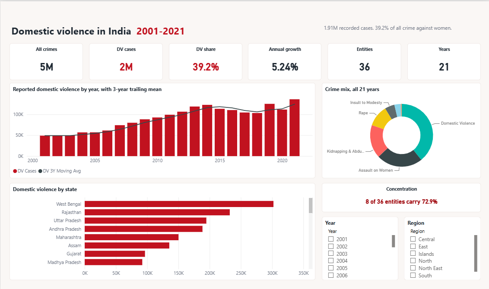

# Domestic Violence in India — a 20-Year Analysis (2001–2021)

An end-to-end analytics project on crimes against women in India:
**raw NCRB extract → cleaned and repaired star schema → SQL analytical layer →
Power BI dashboard → interactive web dashboard.**

The focus crime is **domestic violence (IPC 498A — cruelty by a husband or his
relatives)**, which turns out to be the single largest category of recorded crime
against women in India: **1,909,978 cases, 39.2% of all 4.87M recorded cases** over
21 years — more than rape, dowry deaths and insult to modesty combined.

| | |
|---|---|
| **Source** | NCRB *Crime in India* annual reports 2001–2021 (Kaggle mirror), 736 × 9, cross-checked against the published PDF |
| **Model** | Star schema — 5,019 fact rows at `state × year × crime head` |
| **Coverage** | 36 states and union territories · 21 years · 7 crime heads |
| **Stack** | Python (pandas) · SQL (SQLite) · Power BI (PBIP/TMDL + DAX + M) · Excel VBA · HTML/CSS/JS |



<sub>Executive Overview — the full 1280×720 report page. Red is reserved for the two
focus-crime figures so the eye lands on them; every other series is warm neutral.</sub>

### Two live sites, both zero-build and dependency-free

| Site | Live | Folder |
|---|---|---|
| Interactive dashboard | [domestic-violence-dashboard.netlify.app](https://domestic-violence-dashboard.netlify.app) | [`dashboard/`](dashboard/index.html) |
| Power BI replica | [domestic-violence-powerbi-showcase.netlify.app](https://domestic-violence-powerbi-showcase.netlify.app) | [`powerbi-showcase/`](powerbi-showcase/index.html) |

The replica is not a screenshot gallery. Each page is a 1280×720 canvas holding the same
tiles at the same coordinates as the Power BI layout, recomputing every measure in the
browser — slicers filter and clicking a bar, slice or row cross-filters, the way Power BI
does. Its figures reconcile against the model exactly, down to
*"8 of 36 entities carry 72.9%"*.

---

## The headline of this project is a bug, not a chart

The public dataset this project starts from is **silently broken for 2020 and 2021**,
and the break is invisible unless you check. Reading it as published gives you:

| Entity | DV cases 2019 | DV cases 2020 *as published* |
|---|---|---|
| Delhi | 3,792 | **3** |
| Dadra & Nagar Haveli (pop. 344,000) | 3 | **2,557** |

Delhi did not stop having domestic violence, and a union territory of 344,000 people
did not out-report Delhi.

**Root cause.** On 31 Oct 2019 Jammu & Kashmir became a union territory and **Ladakh**
was carved out of it; on 26 Jan 2020 Dadra & Nagar Haveli merged with Daman & Diu. So
NCRB's 2020 table lists 28 states then 8 UTs — J&K moved down into the UT block, Ladakh
added, two western UTs collapsed into one row. Whoever built the CSV pasted that value
block against a label column still generated from the **pre-2019** 36-entity list, where
J&K sits alphabetically among the states at position 9. **Every measure row from
position 9 down is attached to the wrong state name**, and Ladakh's row inherits the
label "Delhi UT".

**The repair is deterministic, not guesswork** — NCRB's 2020 entity order is public
record. It is defended by four independent tests in
[`etl/02_validate_repair.py`](etl/02_validate_repair.py):

| Test | What it rules out | Result |
|---|---|---|
| Anomaly detection (2020 vs 2017–19 mean) | "nothing is actually wrong" | 16 of 32 entities outside a 0.25×–4× band |
| Profile matching (crime-mix fingerprints, log space) | "the misalignment is random" | 2019 control: **34/36** match their own labels. 2020: only **10/36** — but **28/34** match the NCRB order |
| Continuity (YoY swing distribution) | "the fix made it worse" | median \|YoY\| **71.2% → 13.9%**; implausible (>60%) jumps **15 → 0** |
| Invariance (all 7 measure totals) | "you invented data" | **all deltas zero** — the repair re-labels, it never invents |

The 2019 control is the test that matters: running the same profile-match on a year I
believed was *correct* and getting 34/36 is what proves the method detects misalignment
rather than manufacturing it. And because the repair only moves attribution, **every
national figure is identical with or without it** — only state-level 2020–21 attribution
was ever at risk.

**A second defect:** Assault on Women reads **0 for all 35 entities in 2011**, against
40,012 in 2010 and 45,344 in 2012 — a dropped column. Those cells are flagged and
excluded, and 2011 is marked non-comparable, which is why the DV-share series is left
**blank** for 2011 rather than printing a false 55.5% spike.

---

## The data model

A star schema, not one wide sheet. The source arrives with one column per crime
(`Rape`, `K&A`, `DD`, `AoW`, `AoM`, `DV`, `WT`), which cannot answer "which crime head
grew fastest" without seven near-duplicate measures. Unpivoting makes crime type a real
dimension: one measure and one slicer instead of seven columns.

- **`fact_crimes`** — 5,019 rows at `state × year × crime_type`
- **`dim_state`** (36) · **`dim_year`** (21) · **`dim_crime_type`** (7)

**Three kinds of zero** are separated by `data_quality_flag`, because conflating them is
how a dashboard becomes confidently wrong:

| Flag | Meaning | Example |
|---|---|---|
| `entity_not_formed` | the entity did not exist yet | Telangana < 2014, Ladakh < 2020 |
| `source_gap` | the measure is missing from the export | Assault on Women, 2011 |
| `ok` | a genuine zero | Lakshadweep really reports 0 DV in some years |

`include_in_analysis` is the single boolean every query filters on, so the rule lives in
one place instead of being re-derived in SQL, DAX and Python separately.

---

## The Power BI layer

Committed as **PBIP/TMDL**, not a binary `.pbix` — every table, measure and relationship
is a plain-text file that reviews in a pull request.

**5 pages · 40 visuals · 30 phone placements · 42 DAX measures.**

| Page | The question it answers |
|---|---|
| Executive Overview | How big is this, and is it getting worse? |
| Crime Type Trends | Is domestic violence growing faster than everything else? (No.) |
| State Deep Dive | Where is it worst — and does that depend on how you ask? |
| ABC & Priority | If you could only fund eight programmes, which eight? |
| Data Quality | Why you can trust these numbers, and where I refused to publish one |

### Decisions worth defending

- **Power Query reads `processed/`, not `raw/`.** The 2020–21 repair lives in the ETL and
  nowhere else. Re-implementing it in M would put one business rule in two languages and
  guarantee they drift.
- **No date table.** The grain is annual. A marked calendar would allow
  `SAMEPERIODLASTYEAR` against 21 synthetic timestamps — correct answers, implied
  precision the source does not have. Year-over-year is an explicit integer offset.
- **`[DV Share %]` returns blank when every visible year is non-comparable.** Select 2011
  alone and the card goes empty rather than printing ~55% off a denominator 40,000 cases
  short. **A dashboard should be silent where the data is unsound rather than plausible.**
- **The report layout is generated, not hand-drawn.** `generate_report.ps1` holds a compact
  declaration and emits `report.json`; a build-time validator refuses to write a report
  containing overlapping or off-canvas visuals.

---

## Two segmentations that disagree — on purpose

**ABC classification** (volume): **8 of 36 entities carry 72.9%** of all recorded domestic
violence. That is the most actionable number in the project — a national intervention
needs 8 well-funded programmes, not 36 thin ones.

**Risk zones** (intensity): cases per lakh women, banded at the **quartiles** of the 2021
distribution — 2.5 / 9.1 / 22.9. Quartiles rather than round numbers on purpose: round
thresholds encode an opinion about what counts as "high" and quietly change meaning on
the next refresh.

The two name different states, and the gap is the insight:

- **West Bengal** leads on volume (302,143 cases) — but ranks **6th** on intensity.
- **Telangana** and **Assam** top the intensity ranking despite far smaller caseloads.
- Class **C + Critical** entities are small but intense — buried entirely by any
  volume-only ranking.

A dashboard that ranks only by volume is a population map with extra steps.

---

## Selected findings

1. Domestic violence is **39.2%** of all recorded crimes against women — more than rape,
   dowry deaths and insult to modesty combined.
2. Reported cases compounded at **5.24%/yr**, 49,032 (2001) → 136,234 (2021), **+178%**.
3. **2020 fell 11.0%**, then **2021 rebounded +22.1%** — best read as lockdown suppressing
   *reporting access*, not violence, with the backlog arriving in 2021.
4. **Dowry deaths are flat** — 6,738 (2001) → 6,753 (2021), CAGR 0.01% — while every other
   head grew. Deaths are the hardest category to under-report, so that flatness argues the
   growth elsewhere is substantially a *reporting-propensity* story.
5. Fastest-growing heads are **kidnapping (8.9%/yr)** and **trafficking (11.9%/yr)**, both
   well above domestic violence.

Finding 4 is the one I would lead with in a review. It is an argument, not a proof — this
data cannot separate incidence from reporting — and saying so is the point.

---

## Honest limitations

- NCRB counts cases **reported to police**, not incidents. NFHS-5 puts spousal violence
  prevalence near 1 in 3 ever-married women — orders of magnitude above anything here.
  Every number in this project is a *reporting* measure.
- Rates use a **fixed Census 2011** denominator (the 2021 census was postponed), so they
  are a comparable index, not a live incidence rate.
- Three series carry documented breaks — **AoW** (2011 gap, 2013 statutory widening),
  **AoM** (unexplained 2014/2017 steps), **WT** (2011 reporting change). The model flags
  them as `Is Comparable Series = FALSE`; do not trend across those years.
- Undivided Andhra Pradesh includes Telangana before 2014, and J&K counts before 2020
  include Ladakh while its denominator excludes it — both need care in cross-year
  comparisons.

---

## Repository layout

```
data/       raw Kaggle extract + source PDF · state reference · processed star schema
etl/        01_clean_and_wrangle.py (10-step pipeline) · 02_validate_repair.py (the four tests)
sql/        schema DDL · KPIs · window functions · ABC · CASE-based risk zones · joins
            · 12-assertion data-quality audit · QUERY_RESULTS.md with real outputs
powerbi/    DomesticViolence.pbip · TMDL model (5 tables, 4 relationships, 42 measures)
            · generate_report.ps1 (layout -> report.json) · annotated m/ and dax/
excel/      CleanCrimeData.bas — the Excel-side normalise / unpivot / flag macro
dashboard/  5-page web dashboard + build_data.py
docs/       DASHBOARD_GUIDE.md · INTERVIEW_PREP.md
```

### Reproducing it

```bash
python3 etl/01_clean_and_wrangle.py    # clean, repair, reshape -> data/processed/
python3 etl/02_validate_repair.py      # prove the repair
python3 sql/build_and_run.py           # build SQLite, run 21 queries, run 12 checks
python3 dashboard/build_data.py        # regenerate data.js for both sites
powershell -File powerbi/generate_report.ps1   # regenerate the report layout
```

Then open `powerbi/DomesticViolence.pbip`, point the **`RepoRoot`** parameter at your
clone (*Transform data → Manage Parameters*), and **Refresh** — a PBIP stores definition
only, so the first open always needs one refresh to populate the model.
